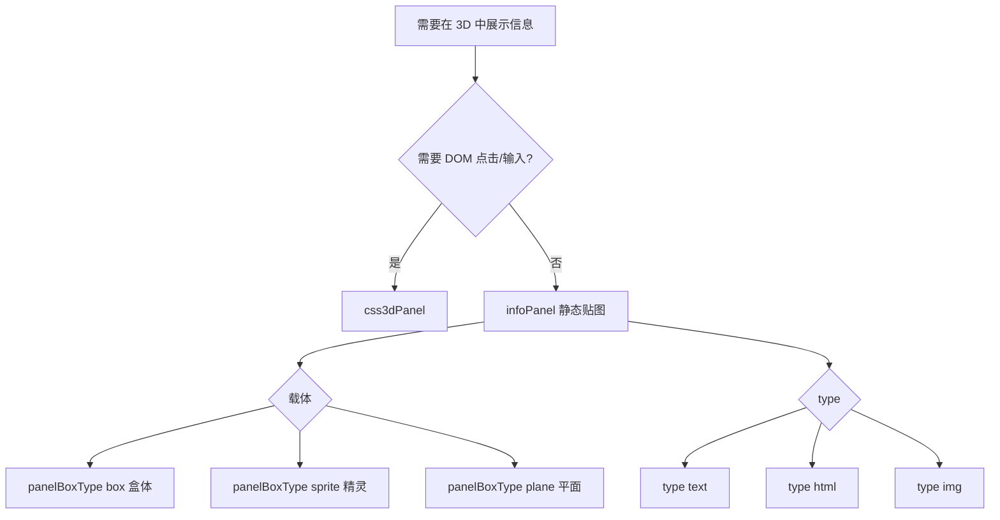

[中文](./info-panels.md) | [English](../en/info-panels.md)

# 信息面板专题

[中文](./info-panels.md) | [English](../en/info-panels.md)

ThreeJSON 提供多种在 3D 场景中展示标注与信息的方式。本文说明如何选型、编写 JSON，以及命令式 API 与宿主交互模式。JSON 字段契约详见 [json-format.md § 信息面板](./json-format.md#信息面板-infopanel) 与 [§ css3dPanel](./json-format.md#可交互-css3d-面板-css3dpanelcore)；API 见 [api.md § infoPanelBuilder](./api.md#corebuilderinfopanelbuilderjs)。

## 选型总览



| 能力 | objType / 列表 | Billboard | DOM 可交互 | 典型场景 | 友好 JSON 列表 |
|------|----------------|-----------|------------|----------|----------------|
| 盒体信息面板 | `infoPanel` + `panelBoxType: "box"` | 否 | 否 | 墙面标牌、立体看板 | `infoPanelList` |
| 精灵信息面板 | `infoPanel` + `panelBoxType: "sprite"` | 是 | 否 | 悬浮标签、设备铭牌 | `infoPanelList` |
| 平面信息面板 | `infoPanel` + `panelBoxType: "plane"` | 否 | 否 | 贴墙/贴门固定朝向标牌 | `infoPanelList` |
| 文字贴图 | `infoPanel` + `type: "text"` | 取决于载体 | 否 | 纯文本提示 | `infoPanelList` |
| HTML 贴图 | `infoPanel` + `type: "html"` | 取决于载体 | 否（html2canvas 截图） | 富文本看板 | `infoPanelList` |
| 图片贴图 | `infoPanel` + `type: "img"` | 取决于载体 | 否 | Logo、示意图 | `infoPanelList` |
| CSS3D 面板 | `css3dPanel` | 否 | **是** | 控制台、表单、iframe | `css3dPanelList` |
| 场景纯文字 | `text` | 可选 `billboard` | 否 | SDF 标签、立体标题 | `textList` / `objectList` |
| 图标标记 | `sprite` | 是 | 否 | 地图 pin、状态点 | `spriteList` |

**分工要点**：

- **`infoPanel`**：内容烘焙为 WebGL 纹理（Canvas 或 html2canvas），适合静态标牌；`sprite` 载体始终面向相机。
- **`css3dPanel`**：真实 DOM 叠在 WebGL 之上，适合按钮、输入框、iframe；见 demo [t04-06](../../examples/html-demo/track-04-interaction/04-06-css3d-panel.html)。
- **`text`**：无强制背板的文字实体（SDF / texture / mesh），见 Track 7。
- **`sprite`**：单张贴图标记，不是多行文本面板。

## 实现架构（core）

非 CSS3D 的静态信息面板由 [`core/builder/infoPanelBuilder.js`](../../core/builder/infoPanelBuilder.js) **单一解析管线**处理：

1. **`normalizeInfoPanelDescriptor`** — 补齐 JSON 默认值（`panelBoxType`、`type`、`panel.*` 等）
2. **`createInfoPanelDescriptor`** — 由文本与坐标快捷拼装描述符（不入场景）
3. **`resolveInfoPanelTexture`** — 按 `type: text | html | img` 生成/加载 `THREE.Texture`（Promise）
4. **`buildInfoPanelObject`** — 按 `panelBoxType: box | sprite | plane` 构建 Mesh 或 Sprite
5. **`deployInfoPanel`** — 纹理就绪后 `scene.add`（主入口）

`css3dPanel` 由 [`core/builder/css3d/`](../../core/builder/css3d/) 独立部署，**不经过**上述管线。

## 静态 infoPanel：载体 × 内容

> **尺度**：html-demo tutorial 中 infoPanel 世界宽多在 **12–20** 左右（约 1 单位≈1 米的 demo 惯例）。详见 [html-demo README § tutorial 尺度约定](../../examples/html-demo/README.md#tutorial-尺度约定)。

### 盒体面板（`panelBoxType: "box"`）

有厚度（`panelDepth`），可绕场景旋转摆放；`textFace: "full"` 时六面使用同一贴图（薄盒体效果）。

```js
{
  name: "panel-box-text",
  type: "text",
  panelBoxType: "box",
  text: "盒体文字面板\ntextFace: single",
  color: "#ffffff",
  backColor: "#409eff",
  panelWidth: 12,
  panelHeight: 6,
  panelDepth: 0.4,
  textFace: "single",
  panel: {
    position: { x: -9, y: 8, z: 0 },
    geometry: { width: 12, height: 6, depth: 0.4 }
  }
}
```

### 精灵面板（`panelBoxType: "sprite"`）

始终面向相机，适合远距离可读标签；可设 `borderRadius` 圆角。

```js
{
  name: "panel-sprite-text",
  type: "text",
  panelBoxType: "sprite",
  text: "精灵文字\n始终朝向相机",
  color: "#ffffff",
  backColor: "#303133",
  borderRadius: 8,
  panelWidth: 14,
  panelHeight: 6,
  panel: {
    position: { x: 9, y: 8, z: 0 },
    geometry: { width: 14, height: 6, depth: 1 }
  }
}
```

### 平面面板（`panelBoxType: "plane"`）

固定朝向的单/双面 `PlaneGeometry`（+Z 为贴图正面），无厚度；**不支持** `textFace: "full"`。未写 `panel.material.side` 时默认 **`double`**（双面可见）；可显式设 `front` | `back`。

```js
{
  name: "panel-plane-text",
  type: "text",
  panelBoxType: "plane",
  text: "平面标牌",
  color: "#ffffff",
  backColor: "#9c27b0",
  panelWidth: 12,
  panelHeight: 5,
  panel: {
    position: { x: 0, y: 8, z: 0 },
    geometry: { width: 12, height: 5 },
    material: { side: "double" }
  }
}
```

### 文字（`type: "text"`）

由 `createStrTextureMultiline` 绘制；可用 `font` 或结构化 `textStyle`（`fontSizePx`、`autoFit`、`padding` 等）。`backColor` 烘焙进贴图背景；**`opacity` 只淡化背景 alpha，文字前景保持不透明**（不会再用 `material.opacity` 整张贴图乘算）。

### HTML（`type: "html"`）

`text` 字段写 HTML 字符串，运行时经 **html2canvas** 转为纹理。**不可点击** DOM 元素。样式请用内联 CSS；复杂布局可参考 [`portShow.json`](../../assets/json/portShow.json) 港口调度条。面板级 **`opacity` 默认会注入 HTML 内联背景色**（不改文字 `color`）；外层 `backColor` 同步淡化。材质层 **`material.opacity` 恒为 1**，文字不会被二次淡化。

| 字段 | 说明 |
|------|------|
| `htmlOpacity` | 仅 `type: html`。`opacity < 1` 时是否把透明度注入 HTML 内联 `background` / `background-color`（默认 **`true`**，显式 `false` 关闭） |
| `opacityByPanel` | `type: text` / `html` / `img`。是否让整个面板内容随 `opacity` 整体淡化（恢复旧版 `material.opacity` 行为，默认 **`false`**，显式 `true` 开启）。开启后跳过贴图 alpha 烘焙；`html` 同时跳过 `htmlOpacity` 背景注入 |

```js
{
  name: "panel-sprite-html",
  type: "html",
  panelBoxType: "sprite",
  text: "<div style='padding:8px;background:#fff;color:#333'><strong>HTML 面板</strong><br/>静态贴图，不可点击</div>",
  panelWidth: 20,
  panelHeight: 7,
  panel: { position: { x: -9, y: 14, z: 4 } }
}
```

### 图片（`type: "img"`）

`text` 字段填图片 URL 或 base64；支持 `contentScale` 缩放显示。**`opacity` 会缩放整张贴图 alpha**（图片与文字一体，无法单独保留前景不透明）。

```js
{
  name: "panel-sprite-img",
  type: "img",
  panelBoxType: "sprite",
  text: "/assets/textures/building/port/port.webp",
  panelWidth: 10,
  panelHeight: 6,
  panel: { position: { x: 9, y: 14, z: 4 } }
}
```

旧字段 **`boxType`** 与 **`panelBoxType`** 等价，新 JSON 请写 `panelBoxType`。

## 字段速查

| 字段 | 说明 |
|------|------|
| `panelBoxType` | `box` \| `sprite` \| `plane`（载体） |
| `type` | `text` \| `html` \| `img`（内容） |
| `text` | 文本 / HTML / 图片 URL |
| `panelWidth` / `panelHeight` / `panelDepth` | 面板世界尺寸 |
| `color` | 前景色（`type: text`） |
| `backColor` | 贴图背景色 |
| `font` | CSS font 简写（`type: text`） |
| `textAlign` | 水平对齐：`left`（默认）\| `center` \| `right`（仅 `type: text`） |
| `textVerticalAlign` | 垂直对齐：`top`（默认）\| `middle` \| `bottom`（仅 `type: text`） |
| `textStyle` | 结构化排版（见 json-format） |
| `textFace` | `single`（默认，正面贴图）\| `full`（**仅 box**：六面同贴图） |
| `borderRadius` | 圆角（纹理逻辑像素） |
| `contentScale` / `contentScaleX` / `contentScaleY` | 内容缩放 |
| `transparent` / `opacity` | 面板半透明程度：`opacity` 烘焙进贴图 alpha（默认 **`material.opacity = 1`**）；设 **`opacityByPanel: true`** 时 text/html/img 均恢复整卡随 `opacity` 淡化 |
| `visible` | 是否参与创建（默认 true） |
| **`dismissTrigger`** | 自动关闭触发（仅 infoPanel）：省略 / `"none"` = 不自动关；`"click"` / `"dblclick"` = 点选该面板时隐藏；`"keydown"` = **Escape** 隐藏。由 core 事件机制 wiring，见 [event-mechanism.md](./event-mechanism.md) |
| **`fix`** | **已弃用**；`true` → 等同 `dismissTrigger: "none"`；`false` → 等同 `"dblclick"`。加载仍兼容，新 JSON 请写 `dismissTrigger` |
| `panel` | `geometry`、`position`、`rotation`、`scale`、`material` |

`textStyle` 常用：`fontSizePx`、`fontFamily`、`padding`、`lineHeight`、`autoFit`、`fitRatio`、`minFontPx`、`maxFontPx`。

## 部署方式

### 1. 友好 JSON 列表（推荐）

```js
worldInfo: {
  infoPanelList: [
    { type: "text", panelBoxType: "sprite", text: "...", panel: { position: { x: 0, y: 10, z: 0 } } }
  ]
}
```

`createJsonScene` 加载时自动 deploy；单条可省略 `objType: "infoPanel"`。

### 2. 命令式创建 / 更新

```js
import {
  deployInfoPanel,
  updateInfoPanel,
  updateInfoPanelContent
} from "threejson/core";

await deployInfoPanel(scene, descriptor);
await updateInfoPanel(threeJsonId, partial, { scene });
await updateInfoPanelContent(threeJsonId, { text: "new" }, { scene });
```

### 3. 批量显隐与关闭

**推荐（core 事件机制）**：`fix` 为主开关 — **省略 fix** 或 **`fix: true`** 时面板不可通过点击关闭；**`fix: false`** 时默认双击面板关闭（ELM 自动 wiring）。需 click / Escape 等进阶关法时在 **`fix: false`** 下再加 `dismissTrigger`。详见 [event-mechanism.md § infoPanel dismissTrigger](./event-mechanism.md) 与 demo [t04-08](../../examples/html-demo/track-04-interaction/04-08-info-panel-gallery.html)。

业务菜单切换时常用：`applyInfoPanelList(scene, list)` 或逐条 `updateInfoPanel`。

## css3dPanel 衔接

需要 **可点击按钮、输入框、iframe** 时，改用 `css3dPanel`，不要指望 `infoPanel` + `type: html` 响应交互。

- 配置：`worldInfo.css3dPanelList[]`、`sceneConfig.extensions.css3d`
- 教程：[t04-06](../../examples/html-demo/track-04-interaction/04-06-css3d-panel.html)、[t04-07 曲面屏](../../examples/html-demo/track-04-interaction/04-07-css3d-curved-browser.html)
- 契约：[json-format § css3dPanel](./json-format.md#可交互-css3d-面板-css3dpanelcore)

## 宿主交互模式（进阶）

### 设备面板（device 域）

UPS、空调等设备 record 可通过 **`devicePanelRef`**、**`info`** 简写或内嵌 **`infoPanel`** 绑定面板（优先级 **ref > info > infoPanel**）。deploy 后 `userData.objJson.devicePanelRef` 为运行时真源；`showDevicePanel` / `bindDevicePanelTriggers` 读此字段。

**重要：`devicePanelRef` 写错仅 warn，不 fallback。** 只要 JSON 写了非空 `devicePanelRef`，即使同 record 还有 `infoPanel`，resolver 也 **只走外部引用**，ref 无效时 **不会** 自动显示内嵌面板。请修正 ref 或删除 `devicePanelRef`。详见 [api.md § domains/device](./api.md#domainsdevice-设备面板)。

机柜等嵌套 `infoPanel` 的业务 JSON 应使用设备 record 上的 **`panelShowTrigger` / `panelHideTrigger`**（见 [api.md § domains/device](./api.md#domainsdevice-设备面板)）。事件机制会派生对应的 device panel action，并在首次显隐时按 `topDistance` 自动 deploy 内嵌面板；`room-show.html` 已按该模式迁移，`port-show.html` 暂保留宿主页逻辑待后续迭代。

## 常见问题

| 问题 | 说明 |
|------|------|
| HTML 面板空白 | 检查 html2canvas 是否加载（import map 需 `html2canvas-pro`）；HTML 尽量内联样式 |
| 图片不显示 | `type: img` 的 `text` 须为可访问 URL；注意跨域 |
| 圆角无效 | `borderRadius` 由贴图 alpha 实现；`type: img` 需 PNG 透明边或配合圆角参数 |
| 面板需双击关闭 | JSON 设 **`fix: false`**（默认可双击关；core 自动 wiring） |
| 面板需 Escape 关闭 | **`fix: false`** + `dismissTrigger: "keydown"` |
| 业务菜单批量清面板 | `setAllInfoPanelsVisible` / `setObjectsVisibleByNames` 等显隐 API，与 dismiss 正交 |
| 需要表单交互 | 改用 `css3dPanel` |

## 延伸阅读（Demo）

| ID | 页面 | 说明 |
|----|------|------|
| t01-01 | [01-01-group-line-panel.html](../../examples/html-demo/track-01-geometry/01-01-group-line-panel.html) | 最简 `infoPanelList` + 显隐 API |
| **t04-08** | [04-08-info-panel-gallery.html](../../examples/html-demo/track-04-interaction/04-08-info-panel-gallery.html) | **静态类型一览**（6 种组合） |
| t04-06 / t04-07 | [04-06-css3d-panel.html](../../examples/html-demo/track-04-interaction/04-06-css3d-panel.html) | 可交互 CSS3D |
| t02-05 | [02-05-scene-background.html](../../examples/html-demo/track-02-visual-fx/02-05-scene-background.html) | 运行时动态创建/更新 sprite 面板 |
| — | [room-show.html](../../room-show.html) / [port-show.html](../../port-show.html) | 业务大屏批量 `infoPanelList` |

示例 JSON 资产：[`04-08-info-panel-gallery.json`](../../assets/json/tutorial/track-04/04-08-info-panel-gallery.json)、[`portShow.json`](../../assets/json/portShow.json)、[`roomShow.json`](../../assets/json/roomShow.json)。
