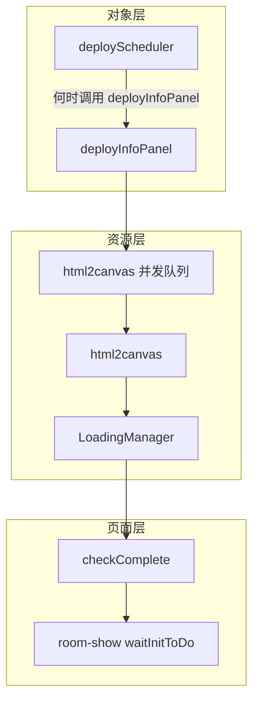

> **归档**：方案 **`rejected`**；Debug 内联队列保留。见 [`../CONVENTIONS.md`](../CONVENTIONS.md)。

# 信息面板 html2canvas 并发治理 — 搁置备忘

**状态**：`rejected`（不建议按 §2 正式化方案实施）  
**日期**：2026-06-25  
**关联**：[infoPanelBuilder.js](../core/builder/infoPanelBuilder.js)、[deployScheduler.js](../core/runtime/deployScheduler.js)、[loading.js](../core/cache/loading.js)、[room-show.html](../room-show.html)、Cursor plan `html_panel_concurrency`

与 [`doc/scope.md`](../doc/scope.md) 无发布承诺。本文记录曾讨论的治理方案及**为何搁置**，供日后查阅，避免重复走弯路。

---

## 1. 背景

room-show 在虚拟机（无独显、软件 WebGL、内存紧张）下曾出现 loading 结束后白屏。Debug 日志显示 `contextLost: true`，场景对象仍在（`sceneChildren` 正常），与信息面板 API 重命名无因果关系。

**已落地、保留的临时修复**（Debug 阶段，**不撤销**）：

| 改动 | 位置 | 作用 |
|------|------|------|
| `runHtmlTextureJob` 全局队列，`HTML_TEXTURE_MAX_INFLIGHT = 2` | [infoPanelBuilder.js](../core/builder/infoPanelBuilder.js) | 限制并行 `html2canvas`，降低内存峰值 |
| `loadingManager.itemStart` / `itemEnd` | 同上 `renderHtmlTexture` | html 贴图纳入 `checkComplete()` |
| `webglcontextlost` / `webglcontextrestored` | [room-show.html](../room-show.html) | 弱环境 context 恢复 |

根因之一：大量 html 信息面板并行 `html2canvas`（含 subScene 机柜门 burst、`refreshInfoPanelList` 直调），在低配环境放大为 WebGL context lost。

---

## 2. 曾讨论的方案（已搁置）

### 2.1 方案 A — 深度整合 deployScheduler（已否）

- 将 `type: html` 的 infoPanel 标为 deployScheduler **phase2 async job**
- 新增 `maxInFlightHtmlPanel`，与 `maxInFlightAsync` 并列
- 所有 deploy 入口 `await deployInfoPanel`，拉长 `createJsonScene` 完成语义

**搁置原因**：与 deployScheduler 职责边界冲突（见 §4）。

### 2.2 方案 B — 单层 HtmlTextureScheduler + deployScheduler 配置（已否）

- 抽出 `core/runtime/htmlTextureScheduler.js`
- `sceneConfig.deployScheduler.maxInFlightHtmlPanel` 配置并发
- `createJsonScene` 启动时 `configureHtmlTextureScheduler`
- **不**改 deployScheduler async 池；subScene 仍 fire-and-forget；`createJsonScene` resolve 时机不变

**搁置原因**：配置挂在 `deployScheduler` 下仍暗示「对象调度器管纹理」；与 §4 分层原则不符。Debug 内联队列已够用，抽模块/JSON 可配属过度工程。

### 2.3 用户已确认的决策（讨论记录）

| 议题 | 结论 |
|------|------|
| 并发层数 | 单层队列即可，不要 deployScheduler html async 池 |
| subScene | 保持同步遍历，靠全局队列限流 |
| createJsonScene | 保持现有时机；loading 靠 LoadingManager + `checkComplete()` |

上述决策仍成立，但**整包「正式化方案 B」不再实施**——保留 Debug 代码即可。

---

## 3. 架构分层（正史理解）

- **deployScheduler**：单位是 **object deploy job**（分帧 / timeslot / externalModel async 池）。不管纹理、不管 html2canvas。
- **LoadingManager**：单位是 **异步资源项**（贴图、模型、字体；html 面板通过手动 `itemStart/itemEnd` 对齐）。
- **html2canvas 队列**：单位是 **单次 html 纹理生成**，因不走 THREE Loader，需单独限流。属于 infoPanel 实现细节，**不是** Scheduler 的延伸。

---

## 4. 评估与结论 — 为何不建议实现搁置方案

### 4.1 deployScheduler 不应下沉到纹理层

deployScheduler 针对 **object record 的 deploy 节奏**。若 Scheduler「接管 html 信息面板纹理」，则逻辑上必须回答：

- img 信息面板的 `TextureLoader` 是否也要进 Scheduler？
- 普通 mesh、机柜 U 位贴图、HDR 背景是否同样接管？

边界会迅速模糊，Scheduler 不再是「对象部署调度器」，而变成未定义的「全局资源调度器」。**架构不妥。**

### 4.2 html 特殊 ≠ 应纳入 deployScheduler

`type: html` 走 `html2canvas`，不经过 THREE Loader 管线，因此需要：

- **LoadingManager 计数**（进度 / `checkComplete`）— 合理，与 Loader 族一致
- **并发上限**（内存峰值）— 合理，放在 [infoPanelBuilder.js](../core/builder/infoPanelBuilder.js) 或小 util

这不构成把配置写入 `sceneConfig.deployScheduler` 或扩展 async 池的理由。

### 4.3 现有 Debug 修复已覆盖核心风险

| 需求 | Debug 是否满足 |
|------|----------------|
| 限制 html2canvas 并行 | 是（`max=2` 硬编码） |
| loading 不提前结束 | 是（LoadingManager） |
| subScene burst | 是（全局队列，与入口无关） |
| deployScheduler 继续管 object 节奏 | 是（未改 Scheduler） |

正式化（抽模块、JSON 可配、与 deployScheduler 耦合）**收益有限**，**易误导职责**。

### 4.4 白屏与环境

虚拟机无 GPU、内存不足会放大任何 html2canvas 峰值；并非信息面板 API 重命名引入的回归。运维上优先保证物理机/独显或调高 VM 内存；代码侧保留 Debug 三层即可。

---

## 5. 当前代码策略（不变）

- **保留** Debug 阶段：`runHtmlTextureJob`、`loadingManager` 挂钩、room-show context 监听。
- **不实施** HtmlTextureScheduler 模块抽取、`maxInFlightHtmlPanel`、deployScheduler html async、scene 加载路径改为 await deployInfoPanel。
- **可选后续**（独立小改，与本备忘无关）：`type: img` 的 `TextureLoader` 接入 `loadingManager`（与 Scheduler 无关）。

---

## 6. 若将来仍感吃紧（非本方案）

产品/实现层手段，不经过 deployScheduler：

- 减少 html 面板数量；能用 `type: text` 则不用 `html`
- 预烘焙贴图或静态资源
- 调低 `HTML_TEXTURE_MAX_INFLIGHT` 常量（改一行，不必 JSON）
- 宿主页降低同时 refresh 的面板数

---

## 7. 退出条件

本备忘可在以下情况关闭或降级为历史：

- 信息面板改为非 html2canvas 管线（如统一 CSS3D / 服务端 rasterize）
- 或 LoadingManager + 常量队列被更通用的「非 Loader 异步资源注册表」取代，且文档明确与 deployScheduler 分离

在此之前：**标记为 parked，不建议按 §2 方案实施。**
