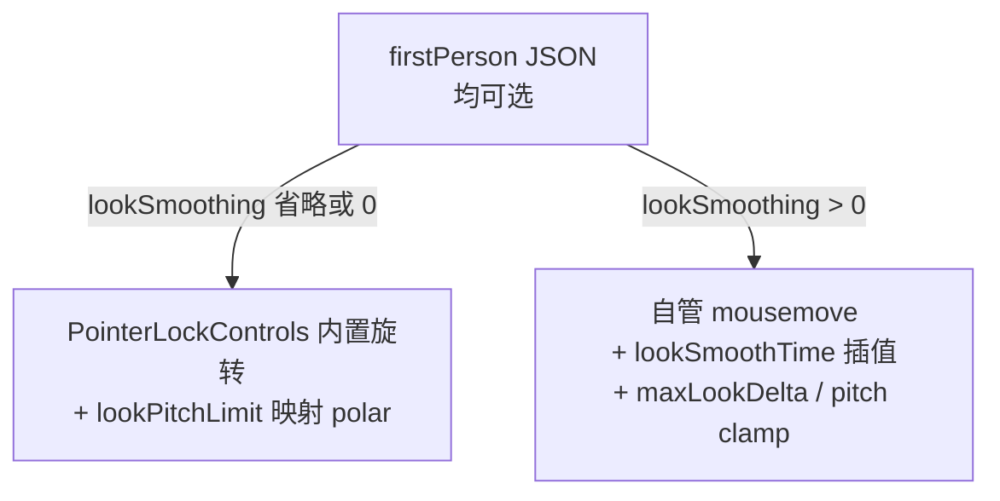

# 第一人称漫游 / FPS 宿主集成备忘

**状态**：`idea` / **部分已落地**（core 环顾与 track-04 教程；业务整合页漫游 **未承诺**）  
**日期**：2026-06-22（环顾契约与 room-show 评估增补）  
**关联**：[room-show-first-person-evaluation-memo.md](./room-show-first-person-evaluation-memo.md)、[`docs/zh/json-format.md`](../docs/zh/json-format.md)、[`extensions/fps-walk/README.md`](../extensions/fps-walk/README.md)

> **非发布承诺**：下文含已实现能力与设想方案；业务页（如 room-show）是否接入见专项评估备忘。

---

## 1. 配置归属

| 块 | 职责 | 环顾 / 移动参数 |
|----|------|-----------------|
| `controls.type: "firstPerson"` | 指针锁定、WASD、灵敏度、碰撞 provider 引用 | **是** |
| `extensions.fps-walk` | 指定地板 `floorMeshRef` 贴地 | 否（行走贴地） |
| `extensions.physics-rapier` | Rapier 世界、重力、静态体 | 否（碰撞物理） |

环顾参数**不要**放进 `physics-rapier`。

---

## 2. 最小路径（仅 core）

JSON：

```json
{ "objType": "controls", "type": "firstPerson", "moveSpeed": 5, "eyeHeight": 1.6 }
```

```javascript
const rt = await createJsonScene(payload, { canvas });
rt.start();
```

省略字段时：PointerLockControls 内置旋转、`lookSensitivity: 0.001`、默认俯仰 ±80°、无平滑。

---

## 3. 推荐路径（扩展自动挂载）

```javascript
import { createPluginHost } from "../core/plugin/pluginHost.js";
import { bootstrapFirstPersonExtensionsFromScene } from "../extensions/fps-walk/bootstrapFirstPersonExtensions.js";

const pluginHost = createPluginHost();
let RAPIER;
if (needsRapier(payload)) {
  RAPIER = (await import("@dimforge/rapier3d-compat")).default;
}

const rt = await createJsonScene(payload, {
  canvas,
  pluginHost,
  async onSceneReady(ctx) {
    await bootstrapFirstPersonExtensionsFromScene({ ...ctx, pluginHost, RAPIER });
  }
});
```

`onSceneReady` 上下文含：`scene`、`camera`、`controls`、`controlsConfig`、`sceneJson`、`sceneConfig`、`worldInfo`。  
**仅当** `controls.threeJsonControlsKind === "firstPerson"` 时扩展才会挂载。

---

## 4. 环顾 JSON 契约（`firstPerson` controls）

**设计原则**（2026-06 讨论结论）：

1. 默认 = **PointerLockControls 内置旋转**（`lookSmoothing` 省略或为 `0`）  
2. 参数均可选；省略即用合理默认，**不必成组配置**  
3. 平滑环顾 **opt-in**（`lookSmoothing > 0`）  
4. 高级项有默认、可单独覆盖（如只改 `lookPitchLimit`）

实现：[`core/handler/controls/firstPersonControls.js`](../core/handler/controls/firstPersonControls.js)、[`firstPersonLookUtils.js`](../core/handler/controls/firstPersonLookUtils.js)



### 常用字段

| 字段 | 默认 | 说明 |
|------|------|------|
| `lookSensitivity` | `0.001` | 弧度/像素；PLC 路径：`pointerSpeed = lookSensitivity * 500` |
| `lookSmoothing` | `0` | `0`~`1`；**>0** 启用平滑环顾（关闭 PLC 内置旋转） |
| `pointerLock` | `true` | 点击画布锁定指针 |
| `moveSpeed` | `4` | WASD 移动速度 |
| `eyeHeight` | `1.6` | 眼高 / 贴地 |
| `floorSnap` | `true` | 向下射线贴地 |

### 环顾细调（均可选）

| 字段 | 默认 | 说明 |
|------|------|------|
| `lookPitchLimit` | `1.396`（≈80°） | 对称俯仰（弧度）；PLC 映射 `minPolarAngle`/`maxPolarAngle` |
| `minPolarAngle` / `maxPolarAngle` | 由 `lookPitchLimit` 推导 | 与 orbit 同语义；**显式写出则覆盖**推导 |
| `maxLookDelta` | `120` | 单帧鼠标位移软上限（像素）；平滑路径完整生效 |
| `lookSmoothTime` | `0.06` | 秒；`blend = 1 - exp(-delta / lookSmoothTime)` |

俯仰换算：对称 `lookPitchLimit = L` → `minPolarAngle = π/2 - L`，`maxPolarAngle = π/2 + L`（与 Three.js r184 `PointerLockControls` 一致）。

### 教程推荐配置（track-04）

```json
{
  "objType": "controls",
  "type": "firstPerson",
  "moveSpeed": 5,
  "eyeHeight": 1.6,
  "lookSensitivity": 0.001,
  "lookSmoothing": 0.18,
  "pointerLock": true
}
```

细调项（`lookSmoothTime`、`lookPitchLimit` 等）可省略，沿用默认。

---

## 5. 碰撞后端选择

| 配置 | 行为 |
|------|------|
| 无 `collision` + `extensions.fps-walk.floorMeshRef` | AABB 贴指定地板 |
| `collision.provider: "rapier"` + 墙体 `physics-rapier fixed` | Rapier CharacterController |
| 仅 core `floorSnap: true` | 全场景向下射线（轻量） |

---

## 6. Player Rig

- JSON：`group` + `refName: "player"`，`camera.attachTo: "player"`。  
- 加载后 core 调用 `attachCameraToPlayerRig`；Rapier 默认跳过 `playerRefName` 的 static collider。

---

## 7. 业务整合页设想（未承诺）

[`room-show.html`](../room-show.html) 是否增加可选「漫游模式」见 **[room-show-first-person-evaluation-memo.md](./room-show-first-person-evaluation-memo.md)**。  
摘要：**非运维大屏刚需**；若做宜 **Orbit / FPS 双模式 HUD 切换**（档位 B），勿替换 JSON 默认 orbit。

[`roomShow.json`](../assets/json/roomShow.json) 中 `fps-walk` 扩展为预留；当前页面仍为 Orbit，扩展未激活。

---

## 8. 明确不属 ThreeJSON core

武器、伤害、网络同步、反作弊 — 宿主或业务 `domain` + `PluginHost` 扩展。

---

## 9. 示例索引

| 资源 | 说明 |
|------|------|
| `assets/json/tutorial/track-04/04-03-fps-walk.json` | 标准 JSON + fps-walk + 平滑环顾 |
| `assets/json/tutorial/track-04/04-04-fps-player-rig.json` | attachTo Rig |
| `assets/json/tutorial/track-04/04-05-fps-rapier-collision.json` | Rapier 围墙碰撞 |
| `examples/html-demo/track-04-interaction/04-03`–`04-05` | 对应 HTML 演示 |
