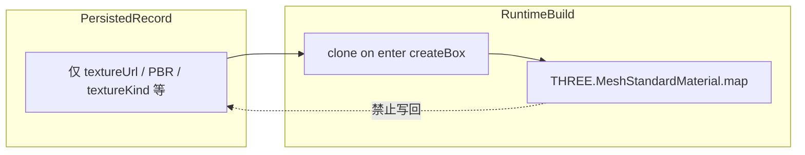

# 材质描述符：持久化 JSON vs 运行时状态（远期根治）

| 字段 | 值 |
|------|-----|
| 状态 | `idea` |
| 与本次修复关系 | 2025 年 box 纹理导出/重载问题已用 **导出 sanitize + `createTextureBox` URL 解析修正** 闭环；本节为 **根治方向**，非当前里程碑 |

## 背景

`userData.objJson` 同时承担：

1. **作者/持久化** 的 scene record（应对齐 `textureUrl`、可选六面 `materials[]`）；
2. **构建期可变缓存**（`ensureMaterialTextureFromJson` 写入 `THREE.Texture` 到 `material.map`；`createTextureBox` 就地扩写 `materials = [material × 6]`）。

导出若直接序列化 live 引用，会出现 `"map": {}`、冗余 `materials[]`，重载时 `createTextureBox` 仅在 `materials[]` 内找 URL 而忽略 `material.textureUrl` 等问题。

**本次止血**（已实施或进行中）：`core/util/descriptorExportSanitize.js` + `createTextureBox` 回退 `material` 上的 URL。

**本节目标**：减少「export 清洗 + load 回退」补丁链，从 schema 与构建契约上分离两层。

## 设计张力（根因）

| 张力 | 表现 |
|------|------|
| 描述符 = 运行时缓存 | `material.map` 在 JSON 对象上承载 `THREE.Texture` |
| `map` 双义 | 持久化可为 URL 字符串；运行时为 Texture；`JSON.stringify` 产生 `{}` |
| `material` vs `materials` 重叠 | 单贴图作者只写 `material`；运行时扩六面；六面贴图作者只写 `materials`（如 `roomShow.json`） |
| 导出入口曾不统一 | editor `sanitizeForJson` vs core `defaultCollectWorldInfoFromScene` 直推 live record |

约定见 [`core/BUSINESS_DOMAINS.md`](../core/BUSINESS_DOMAINS.md)、[`docs/zh/json-format.md`](../docs/zh/json-format.md)（持久化以 `textureUrl` 为主）。

## 远期目标态

## 根治方案（建议分阶段）

### M1 — 构建不可变输入

- `createBox` / `createTextureBox`（及 primitive 同类路径）入口 **clone** 描述符。
- **禁止** 向传入 record 写 `material.map`（Texture）、**禁止** 就地 `boxObj.materials = [material × 6]`（扩写写在 clone 上）。
- 退出条件：全量 deploy + 编辑器 round-trip 回归；live `objJson` 在运行中仍可只读镜像变换。

### M2 — 统一 `toPersistedRecord`

- 单入口：`toPersistedRecord(record)` / `fromPersistedRecord`（或并入 `normalizeScenePayload`）。
- editor 保存、`.tjz`、`exportJsonObject`、AI 写回 **共一条** 持久化路径；`descriptorExportSanitize` 内联为 norm 一步。
- 退出条件：删除 editor 内联材质清洗重复逻辑。

### M3 — 持久化 schema 收窄（开发期可 breaking）

- box 材质块：**仅** 允许 `textureUrl`（及 `textureKind`、`textureRepeat`、PBR 等）；**禁止** 持久化对象形态 `map`。
- `material` 与 `materials` 文档化 **互斥/决策树**：
  - 单贴图 → 仅 `material`；
  - 六面不同贴图 → 仅 `materials`（长度 6），可无 `material`。
- `validateSceneJson` / CI 拒绝违规持久化形状。
- 退出条件：`json-format.md` 规范表 + 测试；仓库权威 JSON 通过校验。

### M4 — 可选友好/标准映射清理

- 在仍处开发阶段时，对 friendly/standard 映射做材质块 breaking 清理。

## 不建议的方向

- 继续堆 **export 启发式**（更复杂的 `detectRuntimeMaterialsArray`）替代 M1+M2。
- 在持久化 JSON 中保留 `THREE` 对象或 `map` metadata 对象。

## 与 intentional 六面贴图

`roomShow.json` 等 **仅 `materials[]`、无 `material`** 为一等能力；根治后 norm 层应 **保留** 该形态，而非依赖 export omit 启发式。

## 参考

- 本次修复计划：`.cursor/plans` / 对话归档「Box 纹理导出重载修复」
- 导出清洗实现：[`core/util/descriptorExportSanitize.js`](../core/util/descriptorExportSanitize.js)
- Box 默认贴图 URL 解析：[`core/util/boxTextureUrl.js`](../core/util/boxTextureUrl.js)
- 纹理 AI 指针：[`core/ai/textureAiService.js`](../core/ai/textureAiService.js)（`material` / `materials[]` / `joins` 嵌套）

## 退出条件（整项 lab 主题）

- M1–M3 落地且 `descriptorExportSanitize` 可删或仅剩断言；
- 文档与 `validateSceneJson` 与实现一致；
- 无「export 清洗 + load 回退」双端补丁需求的新增 case。
