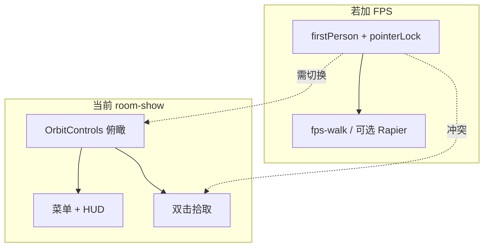

# room-show 第一人称漫游 — 评估备忘

**状态**：`idea`（评估与方案设想，**非实施承诺**）  
**日期**：2026-06-22  
**关联**：[first-person-integration.md](./first-person-integration.md)、[`room-show.html`](../room-show.html)、[`roomShow.json`](../assets/json/roomShow.json)、[`port-show.html`](../port-show.html)

---

## 1. 背景

[`room-show.html`](../room-show.html) 是**核心网络机房 A 区运维大屏**（俯瞰、菜单图层、双击机柜信息面板、告警高亮），不是 FPS 教程页。讨论是否在整合页增加第一人称漫游，及若做时的实现档位。

---

## 2. 现状摘要

| 能力 | 实现 |
|------|------|
| 相机 | Orbit：`DEFAULT_CAMERA` (88,62,-72) → `target` (0,8,-5)；JSON `sceneConfig.controls` 为 orbit |
| 交互 | 左侧菜单（热力图、气流、U 位、环境面板等）；HUD（屋顶/墙体、重置视角、暂停告警）；**双击**拾取 |
| 场景 | [`roomShow.json`](../assets/json/roomShow.json)：约 140×92、18 机柜；`floor-main` 地板 ref |
| FPS 相关 JSON | `sceneConfig.extensions["fps-walk"]` 已写 `floorMeshRef: "floor-main"`，但 `controls.type !== "firstPerson"` 时 **不生效** |
| 页面 | **未**调用 `bootstrapFirstPersonExtensionsFromScene` |

---

## 3. 必要性评估：**偏低（主路径），可选增值**

### 与主目标

运维大屏核心是**一眼看全厅、切图层、点设备看状态、告警醒目**。Orbit 与之一致。第一人称适合**参观/走通道**，与菜单驱动大屏是**并列场景**，不宜替代默认体验。

### 可能价值

- 售前/参观：沉浸式走冷通道  
- 贴近机柜门牌、门禁、漏水绳（常需隐藏墙体或接受穿模）  
- 同一 `roomShow.json` 资产、两种打开方式的产品叙事  

### 不值得做的信号

- 无明确用户故事（运维多数仍俯瞰 + 双击）  
- [`scene-player.html`](../tools/old_version/scene-player.html) 承担巡检/播放；[`track-04` FPS](../examples/html-demo/track-04-interaction/) 已展示引擎能力  
- FPS **不增强**热力图、告警、统计等大屏主功能  

**结论**：**不必作为 room-show 默认能力**；若有「大屏 + 可选走一圈」，宜为 **HUD/菜单第二视角模式**，非全页改版。

---

## 4. 可行性评估：**技术可行，碰撞与模式切换是主成本**

### 可复用

| 组件 | 说明 |
|------|------|
| [`firstPersonControls.js`](../core/handler/controls/firstPersonControls.js) | 灵敏度、平滑环顾、俯仰限制 |
| [`bootstrapFirstPersonExtensionsFromScene`](../extensions/fps-walk/bootstrapFirstPersonExtensions.js) | fps-walk 贴地；Rapier 需 `collision.provider: "rapier"` + 页面加载 Rapier |
| `roomShow.json` | `floor-main`、墙体 `room-wall`、机柜 domain |
| 参考 | [`04-03-fps-walk`](../examples/html-demo/track-04-interaction/04-03-fps-walk.html)、[`04-05-fps-rapier-collision`](../examples/html-demo/track-04-interaction/04-05-fps-rapier-collision.html) |

### 难点

1. **双模式切换**：`resetCameraView()` 依赖 `controls.target`（Orbit）；FPS 需 spawn、`eyeHeight`、pointer lock；退出须恢复俯瞰位。  
2. **碰撞**：仅贴地可穿墙/穿柜；Rapier 需静态体，roomShow 体量大、维护成本高。  
3. **交互**：pointer lock + WASD vs 双击拾取；墙体默认开启时 FPS 几乎不可玩。  
4. **FOV**：roomShow 默认 `fov: 48`（俯瞰）；FPS 常用 70–75，宜分模式。  
5. **后处理**：`sceneHighlight` 基于当前 camera，FPS 下需回归。

**结论**：MVP（贴地、无碰撞）改动集中；**可玩室内漫游**工作量显著上升。

---

## 5. 改动档位（若将来立项）

| 档位 | 内容 | 规模 | 备注 |
|------|------|------|------|
| **A** | 仅把 JSON `controls` 改为 `firstPerson` | ~30 行 | **不推荐**：毁掉俯瞰大屏与双击心智 |
| **B** | HUD「漫游 / 退出」；运行时 Orbit ↔ firstPerson；fps-walk；保存/恢复相机 | **150–250 行**（主改 `room-show.html`） | 建议下限；穿模、偏 demo |
| **C** | B + Rapier 墙体/静态碰撞；可能动生成器 | **400–700 行** | 可演示级 |
| **D** | FPS 下保留单击机柜、告警、与隐藏屋顶/墙体联动 | **800+ 行** | 产品级 |

### 不推荐做法

- 将环顾参数放进 `extensions.physics-rapier`（环顾属 `controls.firstPerson`，见 [first-person-integration.md](./first-person-integration.md)）  
- 用 firstPerson **替换** JSON 默认 orbit controls  

### 与 port-show

[`port-show.html`](../port-show.html) 同为业务大屏，未做 FPS；**俯瞰运维优先**与 room-show 一致。

---

## 6. 建议策略（备忘，非承诺）

1. **维持 Orbit 默认**  
2. 若做：档位 **B 双模式切换**，不改 `roomShow.json` 默认 controls  
3. 先验证：隐藏墙体 + 入口走廊 spawn + fps-walk  
4. 再决定是否上 Rapier  

### 若立项时的任务清单（参考）

1. HUD：`toggleWalkMode` + 模式状态机  
2. `recreateControls(kind)`：orbit ↔ firstPerson，dispose 旧 controls  
3. 仅在 FPS 模式 `bootstrapFirstPersonExtensionsFromScene`  
4. 常量：`FPS_SPAWN`、`FPS_CONTROLS_CONFIG`（如 `lookSmoothing: 0.18`）  
5. 进入 FPS 时可选 `setWallsVisible(false)`、`setRoofVisible(false)`  
6. [`docs/zh/demos.md`](../docs/zh/demos.md) 一句说明是否含漫游模式  

---

## 7. 退出条件

- 产品确认无「沉浸式参观/巡检」需求 → 保持现状  
- 或 track-04 独立 demo + scene-player 已满足演示 → 不在 room-show 重复投入  
