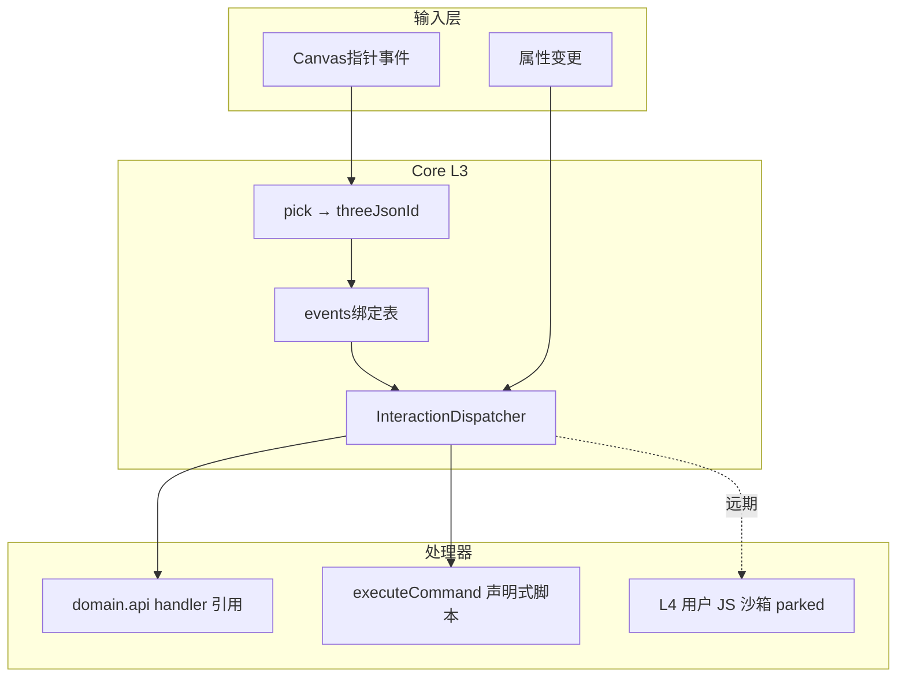
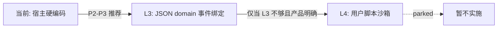
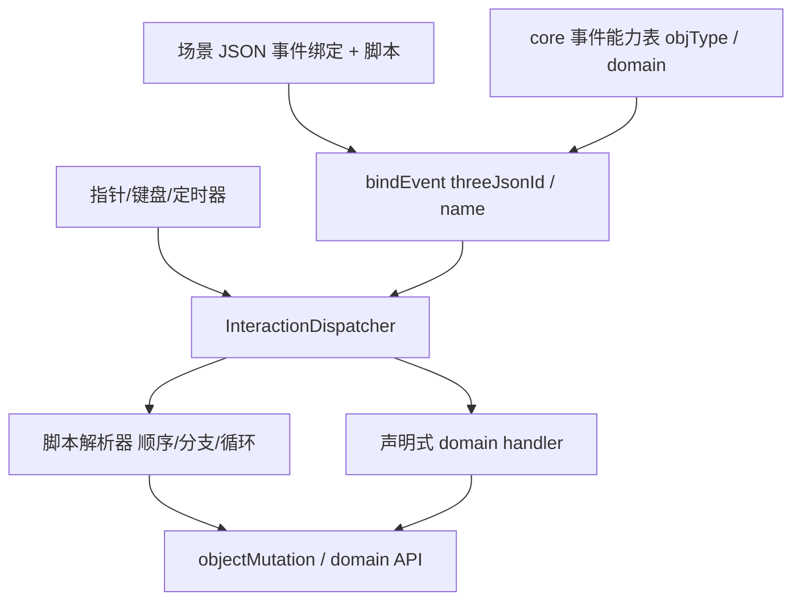

# 场景事件机制 — 评估文档

**状态**：`idea`（L3 **`deferred`** P2–P3；L4 **`rejected`** / parked；**V2 产品设想** §10 **`implemented-phase1+2`** — 见 [`core/runtime/eventMechanism/`](../core/runtime/eventMechanism/) 与 [event_mechanism P2-P3 plan](../../.cursor/plans/event_mechanism_p2-p3_9161ad53.plan.md)）  
**日期**：2026-06-12（2026-06-28 整理：动机与 L3 草图自归档 memo 并入；§10 追加 V2 产品设想）  
**关联**：[scene-editor-ui-memo.md](./scene-editor-ui-memo.md) §八、[roadmap-from-plans.md](./roadmap-from-plans.md)、[standard-json-shape-proposal.md](./standard-json-shape-proposal.md) §10f、[archive/scene-event-driven-memo.md](./archive/scene-event-driven-memo.md)、[archive/domain-event-binding-memo.md](./archive/domain-event-binding-memo.md)

---

## 0. 动机（摘自归档 scene-event-driven）

业务行为（设备告警高亮、面板联动、属性变更响应）**不应**写入场景 JSON（如 `alarmList`）。宜由宿主在 **运行时** 订阅事件并调用 core/domain API。

**设想模型（VB6 式）**：

- **对象**：场景中已 deploy 的实体（按 `threeJsonId` / `name` 定位）。
- **事件**：单击、双击、指针进入/离开、属性变更、跨对象联动。
- **处理器**：宿主注册的回调；可调用 [`sceneHighlight`](../domains/sceneHighlight/)、[`sceneHighlightInteraction`](../core/util/sceneHighlightInteraction.js)、mutation API 等。

**立项退出条件**（未全部满足 → L3 仍为 deferred）：

- 多个业务页重复相同「点击→高亮→面板」链路 — **部分满足**
- 需要可配置交互脚本而非硬编码 HTML — **未满足**（L3 白名单 handler 不算用户脚本）
- 编辑器「预览模式」事件调试需求明确 — **未满足**

**非承诺**：`alarmList` 类业务在 L3 落地前**不得**进入 JSON 契约。

---

## 1. 背景与问题

用户设想：**VB6 式事件模型** — 场景对象拥有可选事件（如 `dblclick`），用户为事件编写响应脚本。

仓库内实际存在**两层不同粒度**的讨论，需分开评估：

| 层级 | 含义 | lab / plan 出处 | 当前状态 |
|------|------|-----------------|----------|
| **L3 声明式事件绑定** | JSON 描述 `{ domain, handler }`，core 统一派发，调用已有 domain API | 本文 §5；[archive/domain-event-binding-memo.md](./archive/domain-event-binding-memo.md) | **`deferred`**（P2–P3） |
| **L4 用户脚本沙箱** | 用户在编辑器内写任意 JS 作为事件处理器 | [roadmap-from-plans.md](./roadmap-from-plans.md) | **`rejected`**（长期 parked） |

**现状痛点**：至少 4 个宿主页面重复实现相近的双击链路：

- [`scene-editor.html`](../scene-editor.html) — `openOrClose` → `door.openOrCloseDoor`；`showDeviceCameraVideo` → `cabinet.getAssociatedDeviceId`；另含编辑器专属的 `transIt`、domain drill-in、属性面板
- [`room-show.html`](../room-show.html)、[`port-show.html`](../port-show.html)、[`scene-player.html`](../scene-player.html) — 同类 door + 摄像头识别逻辑

这与「domain 行为由 JSON/运行时契约驱动，而非宿主写死」的长期方向不一致（Domain 架构核查已记录，**本期保留现状**）。

**已有可演进设施**（尚未接入双击路径）：

- [`registerInteractionResolver`](../core/handler/sceneExtensionRegistry.js) / `resolveInteractionTarget` — door 域已注册
- [`executeCommand`](../core/command/executor.js) — 声明式运行时/文档命令
- [`sceneHighlightInteraction`](../core/util/sceneHighlightInteraction.js) — 高亮效果 API，可作事件处理器内部调用

**尚未存在**：`InteractionDispatcher`、`EventBus`、JSON `events` 字段契约、任何用户脚本沙箱。

---

## 2. 目标模型（澄清 VB6 类比）



**VB6 完整类比**对应 **L4**（对象下拉 + 事件下拉 + 代码窗写 Sub）。  
**近期可落地**的「事件机制」更接近 **L3**：JSON 绑定 + core 派发 + 白名单 domain 方法，**不是**任意用户脚本。

---

## 3. 与现有能力边界

| 能力 | 关系 |
|------|------|
| JSON Patch / `sceneObjectCommands` | 声明式 **状态变更**，非事件总线 |
| [`sceneHighlight`](../domains/sceneHighlight/) locate/info/alarm | 运行时 **效果 API**，可由 L3 事件处理器内部调用 |
| [`executeCommand`](../core/command/executor.js) | 可作为 L3 绑定目标（`{ command: "..." }`），与 AI 面板生成的命令脚本同族 |
| `alarmList` in JSON | **不得**在事件系统完成前进入契约（§10f）；业务告警应走 runtime 订阅 + `sceneHighlight` |
| 宿主硬编码 `mouseDbClickHandler` | 过渡期保留；L3 落地后迁移 door/camera 等业务语义 |

---

## 4. 是否有必要？

### 4.1 L3 声明式 domain 事件绑定 — **有必要，但非 urgent**

**支持立项的理由：**

1. **重复代码**：door 开门、deviceCamera 关联 id 在 4+ 宿主重复；改一处易漏其它页面。
2. **架构一致性**：与 instance-only domain、mutation/command 契约方向一致；避免 `alarmList` 类业务数据重新塞进 JSON。
3. **可测试性**：统一派发后可单测「给定 JSON binding → 调用预期 handler」，而非测各 HTML 内联函数。
4. **partial 基础设施已存在**：`registerInteractionResolver` 证明「从 mesh 解析交互目标」可行。

**暂不 urgent 的理由：**

1. 当前硬编码**能工作**；Domain 架构核查与用户决策均为「本期保留 `door.openOrCloseDoor`」。
2. 编辑器双击还混合**编辑器能力**（`transIt`、drill-in、场景树）与**业务语义**（开门、摄像头），需在设计中明确分层，避免一次改造过大。
3. 本文 §0 **立项退出条件**尚未全部满足：
   - 「多个业务页重复相同点击→高亮→面板链路」— **部分满足**（door/camera 重复，高亮链路仍各页略有差异）
   - 「需要可配置交互脚本而非硬编码 HTML」— **未满足**（若仅 L3 handler 引用，不算用户脚本）
   - 「编辑器预览模式事件调试需求明确」— **未满足**

**结论**：L3 **值得做**，建议作为 **P2–P3 架构债**，在 Domain 架构核查 P0/P1（door 方案 A、instance-only）稳定后再接，避免与大规模 JSON 迁移并行。

### 4.2 L4 VB6 式用户脚本 — **长期有价值，当前无必要立项**

**理由：**

- [roadmap-from-plans.md](./roadmap-from-plans.md) 与 [lab/README.md](./README.md) 已将 **L4 用户脚本沙箱** 标为 **parked**（安全、调试、版本兼容成本高）。
- 现有 `executeCommand` + domain handler 已覆盖多数「可声明化」交互；真需 Turing-complete 逻辑时，更稳妥做法是**宿主应用层**集成（Vue/React 页面），而非在 ThreeJSON 核内嵌沙箱。
- AI 面板（[scene-ai-enhancement-memo.md](./scene-ai-enhancement-memo.md)）生成的是**命令脚本**，与 L4 用户常驻事件脚本属不同产品面。

**结论**：VB6 **完整体验**（用户写任意事件 Sub）**现阶段不建议做**；若用户强需求，应先验证 L3 是否已够用。

---

## 5. 是否可行？

### 5.1 L3 — **可行，工作量中等**

**建议 JSON 形状**（与 [archive/domain-event-binding-memo.md](./archive/domain-event-binding-memo.md) 一致，待正式写入 schema）：

```json
"events": {
  "dblclick": { "domain": "door", "handler": "toggle" },
  "click": { "command": "sceneHighlight.locate id=xxx" }
}
```

**实现要点（分阶段）：**

| 阶段 | 内容 | 依赖 |
|------|------|------|
| **E1** | core `InteractionDispatcher`：canvas 监听 → pick → `threeJsonId` → 查 record.events | 无 |
| **E2** | 绑定解析：`{ domain, handler }` → `invokeDomainModel` / domain 导出 API 表 | [domain-runtime-mutation-contract-memo.md](./domain-runtime-mutation-contract-memo.md) |
| **E3** | 宿主迁移：room/port/player/editor 中 door/camera 硬编码改为 JSON 默认 + 派发 | room-show / roomShow 等资产补 events |
| **E4** | 编辑器：属性面板「事件」区编辑 binding（下拉选 domain handler） | 非多标签 |

**宿主硬编码迁移清单**（L3 落地后）：

| 宿主 | 当前硬编码 | 目标 |
|------|------------|------|
| scene-editor | `door.openOrCloseDoor` | `dblclick` 绑定 |
| scene-editor | `cabinet.getAssociatedDeviceId` + 摄像头 UI | `dblclick` / `select` |
| room-show / port-show / scene-player | door + cabinet/port 设备 id | 同上 |

**不迁移**：编辑器「添加对象」命令（generic `addToScene`）；domain drill-in / 属性面板属编辑器能力。

**编辑器双击分层（关键设计决策）：**

- **进 JSON / dispatcher**：`openOrCloseDoor`、摄像头业务跳转
- **留在编辑器宿主**：`transIt`、`tryEnterDomainDrillIn`、属性面板、BoxHelper — 这些不是「场景可部署语义」

**风险（可控）：**

- pick 对象 vs domain deploy root 不一致 — 可复用 `resolveInteractionTarget` / `resolveDomainDeployRoot`
- 默认行为：无 `events` 字段时是否保留旧硬编码 — 建议过渡期 **opt-in JSON**，再删宿主默认

### 5.2 L4 用户脚本 — **技术上可行，工程上不建议近期做**

需额外建设：

- 沙箱（iframe/worker + API 白名单）
- 脚本持久化位置（`events.dblclick.script` 字符串 vs 外部文件）
- 编辑器调试（断点、错误栈、与 3D 预览同步）
- 安全审查与版本锁定

与 core「声明式、可预测」原则冲突较大；**无 L3 前不建议启动 L4**。

---

## 6. 事件机制是否「必须」多标签编辑器？

**结论：不必须。L3 与 L4 对多标签的依赖不同。**

### 6.1 lab 中的「多标签」指什么

[scene-editor-ui-memo.md](./scene-editor-ui-memo.md) §八：**多标签 = 并行打开多个 JSON 场景文件**（2026-06 延期），与事件机制**无直接因果**，属独立编辑器 UX 增强。

### 6.2 L3 声明式绑定 — **不需要多标签**

- 事件配置是 **对象 record 上的 JSON 字段**，可在现有**属性面板**或场景树上下文菜单编辑（类似 `domain` / `handler` 字段，见 [domain-edit-snapshot-backlog-memo.md](./domain-edit-snapshot-backlog-memo.md)）。
- 单场景 Code 模式（现有 CodeMirror 编辑整份 JSON）已能手工写 `events` 块。

### 6.3 L4 VB6 式脚本 — **不必须多标签，但需要专用脚本编辑 UX**

VB6 原生 UI 是：

- **单代码窗** + 对象下拉 + 事件下拉（`Form1_DblClick`），**不是**多文档标签。

ThreeJSON 可选方案（按实现成本递增）：

| 方案 | 说明 | 是否需要多标签 |
|------|------|----------------|
| **A. 属性面板内嵌** | 选中对象 → 事件列表 → 小 textarea / 折叠区 | 否 |
| **B. VB6 式单窗** | 工具栏选「对象 + 事件」→ 主代码区切换 handler 正文 | 否（推荐若做 L4） |
| **C. 侧栏第二编辑器** | 与 JSON Code 模式并列，PiP 预览不变 | 否 |
| **D. 多标签** | Tab1 场景 JSON / Tab2 某对象 DblClick 脚本 / … | 可选，非最小方案 |

**多标签的价值（可选）：**

- 同时编辑场景 JSON 与多个 event 脚本时不丢上下文
- 与 §八「多场景并行编辑」叠加时可开「场景 A + 场景 B」

**但多标签本身是高成本功能**（每 tab 独立 scene 实例、undo、资源生命周期），**不应作为事件机制的前置条件**。

---

## 7. 综合建议



| 问题 | 结论 |
|------|------|
| **是否有必要？** | L3：**有**，架构与维护收益明确；L4：**现阶段无**，已 parked |
| **是否可行？** | L3：**可行**，可复用 extension registry + command；L4：**可行但成本高** |
| **是否要多标签？** | **否（非前提）**；L3 用属性面板；L4 优先 VB6 式单窗或内嵌编辑器 |
| **推荐动作** | **不启动 L4**；待 Domain P0/P1 完成后，以 E1–E3 spike L3；多标签仍按 UI memo §八 独立排期 |

---

## 8. 待产品确认

若未来 L3 的 `handler` 仅允许 **domain 白名单字符串**（无用户 JS），是否仍满足「VB6 式」产品预期？

- 若 **是** → 按 L3 路线即可，无需 L4。
- 若 **否**（必须写自定义逻辑）→ 需单独立项 L4，并接受安全/调试成本；仍**不建议**以多标签为先决条件。

---

## 9. 相关索引

| 资源 | 路径 |
|------|------|
| 事件动机（归档） | [archive/scene-event-driven-memo.md](./archive/scene-event-driven-memo.md) |
| L3 绑定草图（归档） | [archive/domain-event-binding-memo.md](./archive/domain-event-binding-memo.md) |
| 编辑器 UI（含多标签延期） | [scene-editor-ui-memo.md](./scene-editor-ui-memo.md) |
| Domain 运行时契约 | [domain-runtime-mutation-contract-memo.md](./domain-runtime-mutation-contract-memo.md) |
| 交互解析注册 | [`core/handler/sceneExtensionRegistry.js`](../core/handler/sceneExtensionRegistry.js) |
| Lab 约定与总索引 | [CONVENTIONS.md](./CONVENTIONS.md)、[README.md](./README.md) |

---

## 10. V2 产品设想 — Core 运行时事件机制（VB6 式）

**版本**：V2（2026-06-28，2026-06-28 二期收尾更新）  
**状态**：**`implemented-phase1+2`** — core **M1–M4 + M3b + M-demo** 与 **二期 player/editor/demo** 已落地；**三期** room-show/port-show、domain 业务 JSON 仍待决策。  
**实施计划**：[event_mechanism_p2-p3_9161ad53.plan.md](../../.cursor/plans/event_mechanism_p2-p3_9161ad53.plan.md)（相对 Cursor plans 目录）

**二期已交付（2026-06-28）**：

| 能力 | 位置 |
|------|------|
| `createJsonScene` 自动 bind/dispose ELM | [`core/runtime/eventMechanism/attachSceneEventRuntime.js`](../core/runtime/eventMechanism/attachSceneEventRuntime.js) |
| `interaction.bindSceneEvents`、`dismissTrigger`、per-event `mode` | [`docs/zh/event-mechanism.md`](../docs/zh/event-mechanism.md)、[`docs/zh/json-format.md`](../docs/zh/json-format.md) |
| 通用 player 去 door 硬编码（门等 domain 事件 **三期** JSON 绑定） | [`scene-player.html`](../scene-player.html) |
| 编辑器 `[事件]` 标签、预览/编辑器事件绑定设置、F5 运行场景 | [`scene-editor.html`](../scene-editor.html)、[`tools/scene-host/`](../tools/scene-host/) |
| demo/tutorial `fix` → `dismissTrigger` | [`04-08-info-panel-gallery`](../examples/html-demo/track-04-interaction/04-08-info-panel-gallery.html) |
| `.tjz` tryPack 含 eventScript（默认关） | [`core/util/archiveExportUtil.js`](../core/util/archiveExportUtil.js) |

**背景**：通用 `scene-player.html` / `scene-editor.html` 中历史残留 `objInfoShow`（ComRoom 时代：双击任意 mesh 临时 deploy 嵌套 `infoPanel`）已于 2026-06-28 **彻底移除**。device 域信息面板的 JSON 触发（`panelShowTrigger` 等）与 **door 双击开关**在通用 player 中**暂不接线**——业务页（room-show、port-show）仍保留自有 handler；正确路径是 **core 层 JSON 驱动的事件机制**，domain / objType 各自声明支持的事件与脚本语义（**三期**迁移）。

### 10.1 设计目标

- **JSON 为王**：交互语义写在场景 JSON（或导出时持久化的事件脚本块）中，运行时由 **core 统一派发**，宿主（播放器、编辑器预览）不写 domain 特判。
- **VB6 式心智模型**：对象 + 事件 + 处理器（Sub）；编辑器可选对象/事件下拉 + 脚本编辑窗。
- **分层**：
  - **core objType**（box、group、infoPanel…）：core 维护「各 objType 支持哪些事件、可读写哪些属性」表，并提供绑定 API。
  - **domain**（device、door、cabinet…）：domain 注册扩展事件与 handler；可复用 core 派发管线。
- **可扩展**：第三方 domain / extension 可追加事件名与脚本内可调 API，不修改 core 硬编码分支。

### 10.2 Core 运行时（设想）

| 模块 | 职责 |
|------|------|
| **事件能力表** | `objType → { events: [...], properties: [...], animations: [...] }`；domain 通过注册 API 追加条目 |
| **绑定 API** | 按 `threeJsonId` / `name` / `refName` 为单个或多个对象绑定某事件的处理器 |
| **处理器形态** | (1) 声明式 handler 引用（L3：`{ domain, handler }`）；(2) **内联脚本**（V2 重点）：匿名脚本片段字符串 |
| **脚本语言（受限 DSL）** | 顺序、分支（if/else）、循环（for/while 或 foreach 受限）；**非**任意 Turing-complete JS（除非远期沙箱 L4） |
| **对象引用** | 基于 `refName` / `threeJsonId` / `name` 在脚本内引用其它 3D 对象；支持变换读写（position/rotation/scale/visible 等，按 objType 白名单） |
| **运行时变更** | 脚本执行调用 core **objectMutation** / `applyObjectPartial` / domain 暴露的安全 API，应用属性变更与简单动画 |
| **定时器** | `setTimeout` / `setInterval` 等价物（core 托管，场景 teardown 时清理），用于编排延迟、周期行为 |
| **派发输入** | canvas pointer（click/dblclick/hover…）、键盘、属性变更、自定义 domain 信号 → pick → 查绑定表 → 执行处理器 |



### 10.3 与本文 §1–§5（L3/L4）的关系

| 层级 | 本文旧称 | V2 定位 |
|------|----------|---------|
| L3 | JSON `{ domain, handler }` 白名单 | V2 **子集**：无用户脚本，仍可作为默认/安全模式 |
| L4 | 用户 JS 沙箱 parked | V2 **受限 DSL** 替代部分 L4 需求：可写逻辑但不执行任意 JS |
| V2 完整 | — | L3 + 受限脚本 + 定时器 + refName 对象引用 + objType 能力表 + 编辑器事件 UI |

**立项顺序建议**：先 L3 派发骨架（E1–E2）→ 再接 V2 DSL 与能力表 → 最后编辑器事件管理器 UI。device 面板、door 等 domain 交互 **应迁移到 JSON 事件绑定**，而非恢复宿主 `objInfoShow` 或散落 API 调用。

### 10.4 编辑器 UX（**二期已交付**）

- **入口**：场景树选中对象 → 右栏 **[事件]** 标签（VB6 式：事件下拉 + 脚本 textarea + 应用并绑定 / 切换 DSL·JS）。
- **[场景]** 标签：`interaction.bindSceneEvents` 写回 JSON。
- **infoPanel `dismissTrigger`**：对象属性区编辑（非 [事件] 内置 wiring）。
- **预览/编辑器事件绑定**：设置项拆分，默认编辑画布零 ELM；**运行场景（F5）** 调播放器 + 热更新。
- **domain 对象 [事件]**：空白占位，**三期**再定 UX。

### 10.4a 编辑器 UX 原设想（归档参考）

- **入口**：场景树或画布 **右键物体 →「事件…」**（或属性面板「事件」页）。
- **右侧面板 — 事件管理器**（可与现有资源管理器共用侧栏，**上下分栏**）：
  - **上半：事件选择器** — 选中物体后，下拉列出该 objType/domain **支持的事件**（来自 core 能力表）。
  - **下半：资源管理器** — 保持现有模型/贴图资源浏览（或折叠为下半 tab）。
- **脚本编辑**：选中某事件后，下方 **多行输入框** 编辑该事件的脚本正文；保存写回 JSON（如 `events.dblclick.script` 或 sidecar 块，**schema 待定**）。
- **预览模式**：播放器/编辑器预览走同一套 core 派发，保证「所见即所绑」。

### 10.5 非目标（V2 立项前不变）

- 通用播放器/编辑器 **不**恢复 `objInfoShow` 式宿主特判。
- device 嵌套 `infoPanel` 在 JSON 已定义触发字段时，**等事件机制落地后再自动响应**；此前业务页（room-show、port-show）可自行接线，不属于 core 契约。
- 普通物体嵌套 `infoPanel`（解析器未支持、无 device 契约）：**不**在宿主写默认双击逻辑。

### 10.6 待立项时拆分的 workstream（**三期**）

1. **Schema**：domain 事件块、业务 JSON 批量 `events` 迁移（roomShow/portShow `fix` → `dismissTrigger`）。
2. **Domain 适配**：device（面板显隐）、door（toggle）、sceneHighlight 等注册事件与 handler。
3. **宿主迁移**：room-show、port-show 删除 `hideNonFixInfoPanels` / 硬编码双击，改 JSON 事件绑定。
4. **编辑器 UI**：domain 对象 [事件] 标签 UX。

**二期已完成**（原 workstream 1–2 core、5 编辑器壳层、4 部分 player）：

1. ~~Schema~~：`events.*.script`、`dismissTrigger`、`bindSceneEvents` 已定稿并文档化。
2. ~~Core~~：能力表、ELM、DSL/JS、定时器、canvas pick host。
3. ~~编辑器 UI~~：[事件] 标签、运行场景、tryPack eventScript。
4. ~~player~~：去 door 硬编码；ELM 经 `createJsonScene` 自动 bind。

### 10.7 触发本次 V2 记录的工程决策（2026-06-28）

| 动作 | 说明 |
|------|------|
| 移除 `objInfoShow` | `scene-player.html`、`scene-editor.html`、`tools/scene-host/editor/js/editorInteraction.js` |
| **不**在通用宿主接 device 面板双击 | 避免与未来将有的 JSON 事件机制重复、冲突 |
| 本文 §10 | 记录 V2 大纲，替代「在 HTML 里逐个接 domain API」的过渡方案 |
