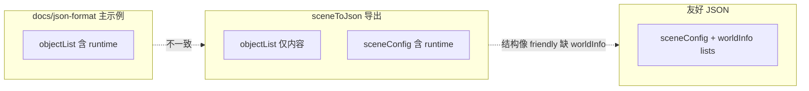
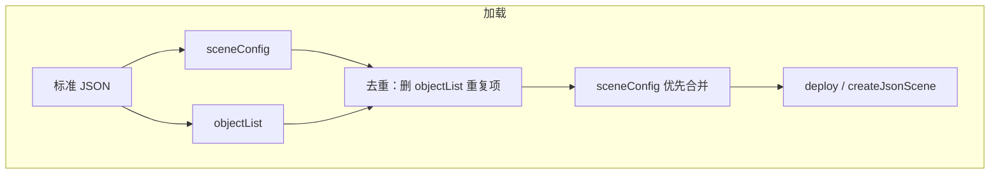

# 标准 JSON 外形讨论稿

**状态**：`shipped`（D0–D5 已落地）  
**日期**：2026-06-02  
**关联**：[scene-canonical-collect-roadmap.md](./scene-canonical-collect-roadmap.md)（反扫 HOW）、[runtime-objtypes-memo.md](./runtime-objtypes-memo.md)（runtime objType 备忘）

> 本文解决 **WHAT**：标准 JSON 文件应长什么样。反扫管线（`sceneToJson` 族）见 roadmap。  
> 讨论定稿后按 §12 阶段 D0–D5 修订 `docs/zh/json-format.md` 正史与实现；**本稿撰写阶段不改 core**。

---

## §1 触发：快照恢复 bug 与更深根因

### 现象

[`scene-editor.html`](../scene-editor.html) 自动快照 → 【从快照恢复】报错：`JSON 格式无效（需要 worldInfo 或标准 objectList）`。

涉及：[`validateLoadedScenePayload`](../scene-editor.html)、[`ingestScenePayloadFromParsedJson`](../scene-editor.html)、[`normalizeScenePayload`](../core/handler/sceneFriendlyNormalizer.js)。

### 直接原因

校验曾要求 `isCanonicalScenePayload`（顶层无 `sceneConfig`），而 [`sceneToJson`](../core/util/sceneToJson.js) 导出产物含 `sceneConfig` + `objectList`，被判为「非标准」。

### 已做临时修复（止血，非终态）

- `validateLoadedScenePayload`：接受非空 `objectList`
- `normalizeScenePayload`：`hasNonEmptyObjectList()` 走 canonical 归一化分支

### 深层问题

**标准 JSON 对外应只有一种外形**，但当前 **doc、demo、实现** 三处不一致：



---

## §2 当前三方记载对照

| 来源 | 标准 JSON 长相 | runtime 位置 | 内容位置 | 顶层元信息 |
|------|----------------|--------------|----------|------------|
| [`docs/zh/json-format.md`](../docs/zh/json-format.md) | `objectList` + 少量元信息 | **在 objectList** | 同 list | `version/name/canvasWidth/extensions` |
| [`docs/zh/design-principles.md`](../docs/zh/design-principles.md) | 同上 | 同上 | 同上 | 「少量元信息」 |
| demo/tutorial（如 [`00-04-standard-objectlist.json`](../assets/json/tutorial/track-00/00-04-standard-objectlist.json)） | 与 doc 主示例一致 | 在 objectList | 在 objectList | 有 canvas 等 |
| [`sceneToJson`](../core/util/sceneToJson.js) + [`sceneRuntimeConfigExport`](../core/util/sceneRuntimeConfigExport.js) | 杂交态 | **sceneConfig** | **objectList** | `worldId/saveMeta/assetLibrary` 等 |
| 友好 JSON | `sceneConfig` + `worldInfo.*List` | sceneConfig | worldInfo 分桶 | 常见 `worldId` 等 |

**结论**：友好 JSON 边界清晰；**标准 JSON 在 doc 与实现之间分裂**。`isCanonicalScenePayload` 是加载探测器，**不能**充当「标准 JSON 定义」。

---

## §3 术语清理

| 禁用或易误导 | 改用 |
|--------------|------|
| strict standard、工作标准形（未入 doc 正史） | **标准 JSON（定稿外形）** / **全 objectList 编排（合法子集）** |
| 「两种标准 JSON」 | **一种对外标准 + 加载器可读的多种合法编排** |

---

## §4 唯一标准 JSON 外形（方案 B，已定）

### 方案 A（doc 现状）：单 `objectList`

runtime 与内容同在 list。

- 优点：单数组、`objType` 统一，程序生成直观。
- 缺点：相机与盒子混排；编辑器/快照/export 人机体验差。

**定稿结论**：方案 A 风格仍是 **同一标准的合法子集**，非次等输入。

### 方案 B（推荐默认外形）

**`sceneConfig`（主 viewport 全局 runtime）+ `objectList`（全部可部署 objType）并行**，顶层元信息并列。二者 **不是互斥**，业务语义不同。

```json
{
  "version": "next",
  "name": "scene-name",
  "threeJsonId": "doc-uuid-or-stable-id",
  "canvasWidth": 1920,
  "canvasHeight": 1080,
  "assetLibrary": [],
  "extensions": {},
  "sceneConfig": {
    "scene": { "background": "#222222" },
    "camera": {
      "fov": 60,
      "jsonOrigin": "config",
      "position": { "x": 0, "y": 0, "z": 5 }
    },
    "controls": {
      "target": { "x": 0, "y": 0, "z": 0 },
      "jsonOrigin": "config"
    },
    "lights": [
      { "type": "ambient", "intensity": 0.45, "jsonOrigin": "config" }
    ],
    "renderLoop": { "autoResize": true }
  },
  "objectList": [
    {
      "objType": "box",
      "name": "floor",
      "geometry": { "width": 1, "height": 1, "depth": 1 }
    }
  ],
  "saveMeta": { "exportMode": "standard_primary" }
}
```

### 与友好 JSON 的硬边界

| 维度 | 标准 JSON（方案 B） | 友好 JSON |
|------|---------------------|-----------|
| 可部署对象 | `objectList`：凡 core 支持的 **objType** 均可（含 `camera`/`light`/`box`/…） | `worldInfo.*List`（**字段名保留**） |
| 主 viewport / 全局 runtime | `sceneConfig` | `sceneConfig`（同左语义） |
| 文档身份 | 顶层 **`threeJsonId`**（**无 `worldId`**） | 顶层 **`threeJsonId`**（**无 `worldId`** / 无 `worldInfo.id`） |
| 页面/业务侧车 | 不进 JSON；对象级 `businessInfo`；场景级 `extensions` | **UI/告警不进 JSON** |

---

## §4b runtime 双通道语义

**纠正早前误解**：`camera`/`light` 等 **本就是正式 objType**（[`CANONICAL_RUNTIME_OBJ_TYPES`](../core/handler/sceneFriendlyNormalizer.js)），不是「误写进 objectList 的 runtime」。详见 [runtime-objtypes-memo.md](./runtime-objtypes-memo.md)。

| 通道 | 业务语义 | 典型用途 |
|------|----------|----------|
| **`sceneConfig.*`** | **全局 / 主 viewport** 场景壳层：无相机看不见、无灯漆黑；绑定 `createJsonScene` 返回的 `runtime.camera` 等 | 编辑器默认导出、单视口应用 |
| **`objectList` 中同 objType** | **可部署对象实例**：可有多个相机、多盏灯（`visible` 等字段）；主相机也可只写在这里 | 多视口、备用机位、与 mesh 同级清单 |

- **加载**：两通道 **都解析**；归一化内部合成带 runtime 条目的 `objectList` 再分 phase deploy。
- **文档推荐**：主 globals 放 `sceneConfig` + 内容放 `objectList`；**全写 objectList**（旧 demo）仍 **合法**。
- **实现缺口（诚实记录）**：[`splitCanonicalObjectList`](../core/handler/sceneFriendlyNormalizer.js) 对 `camera`/`renderer`/`controls` **只保留一条**；多相机完整生命周期属后续扩展，**不阻塞**定稿。



---

## §4c 反扫落位：`jsonOrigin`（已定）

**问题**：scene→JSON 时，同一 `objType:camera` 不知写入 `sceneConfig` 还是 `objectList`。

| 项 | 定稿 |
|----|------|
| 字段名 | **`jsonOrigin`** |
| 取值 | **`"config"`** → `sceneConfig`；**`"list"`** → `objectList` |
| 挂点 | **`camera` / `light` / `controls`** |
| `scene` / `renderer` / `renderLoop` | 默认仅 `sceneConfig`（无 `jsonOrigin` 或恒为 `config`） |

**规则**：

- **加载**：以 JSON **物理位置**为准；自动写入/修正 `jsonOrigin`；用户手写与位置矛盾 → **位置覆盖**标记。
- **导出**：主 viewport → `sceneConfig` + `jsonOrigin: "config"`；其它 deploy 实例 → `objectList` + `jsonOrigin: "list"`。
- **加载 merge**：`sceneConfig` **优先** 定主 viewport；`objectList` 条目作 **额外实例**。
- **两通道重复去重**：同一逻辑对象在两边同时出现 → **移除 `objectList` 侧**，保留 `sceneConfig`。匹配键：**优先 `threeJsonId`，其次 `name`**（同 objType 下比较）。
- **多相机切换**：**不写入 JSON 契约**；由宿主 / 未来 runtime API 处理。
- **性质**：`jsonOrigin` 不参与 deploy 语义，仅服务往返一致性；非白名单字段静默忽略。

---

## §5 方案 B 落地需动的实现点（D1 清单）

1. **导出**：[`sceneToJson`](../core/util/sceneToJson.js) 主 viewport → `sceneConfig` + `jsonOrigin: "config"`；其它 deploy 实例 → `objectList` + `jsonOrigin: "list"`。
2. **归一化**：canonical 分支合并 `sceneConfig` 与 `objectList`；**sceneConfig 优先**；**重复时删 objectList 侧**；[`buildCanonicalScenePayloadFromCanonical`](../core/handler/sceneFriendlyNormalizer.js) 今日 **尚未**合成 sceneConfig runtime（友好路径已有类似逻辑）。
3. **校验**：`(worldInfo) OR (非空 objectList OR 有 sceneConfig 主 runtime)`；不禁止 objectList 含 camera/light。
4. **`isCanonicalScenePayload`**：仅表示「纯 objectList 文件、无顶层 sceneConfig」；**合法**。
5. **编辑器**：`buildEditorScenePayload` 显式保留 `sceneConfig`；反扫实现 §4c。
6. **`sceneToFriendlyJson`**：不变。

---

## §6 顶层身份与元信息

### 标准 JSON（已定）

- **去掉顶层 `worldId`**；场景文档唯一身份：**`threeJsonId`**。
- 允许顶层：`version`, `name`, `threeJsonId`, `canvasWidth`, `canvasHeight`, `assetLibrary`, `extensions`, `saveMeta`（可选）。

### 友好 JSON（已定）

- **保留 `worldInfo` 字段名**（本里程碑不改 `sceneInfo`）。
- **去掉顶层 `worldId`** 与 **`worldInfo.id`**；身份仅用 **`threeJsonId`**。
- 页面/业务侧车不进 `worldInfo`（§10b）。

### `worldInfo` → `sceneInfo` 改名？

**本里程碑不做**。理由：`sceneInfoList` 命名冲突；全仓 100+ 引用；与方案 B 正交。若未来改名，推荐 `worldInfo` → `sceneContent` 且 `sceneInfoList` → `nativeSceneEmbed`（另立里程碑）。

---

## §7 迁移与 demo/tutorial 策略

**必改**（契约变更）：`worldId`、UI chrome 键、`alarmList` 等删除；补 `threeJsonId`。

**runtime 编排**：

- 全 objectList 写法 **继续合法**，不必强行拆到 `sceneConfig`。
- **推荐** tutorial 增加方案 B 分轨示例，与全 objectList 示例并列。
- 可选：[`00-04-standard-objectlist.json`](../assets/json/tutorial/track-00/00-04-standard-objectlist.json) 等迁 primary runtime 到 `sceneConfig`（可读性），**非强制**。

---

## §8 与 sceneToJson / roadmap 的关系

| 文档 | 职责 |
|------|------|
| [scene-canonical-collect-roadmap.md](./scene-canonical-collect-roadmap.md) | **HOW**：反扫管线、`sceneToJson`、merge、编辑器迁移 |
| 本文 | **WHAT**：保存/快照/export 文件外形 |

---

## §9 方案 B 与 AI 影响

**影响量级：中等，偏正面。**

- [`threeJsonCoreSkill.js`](../core/ai/threeJsonCoreSkill.js) 已优先 friendly `worldInfo` + `sceneConfig`。
- 方案 B 使标准 JSON 与 AI 偏好的 **runtime 分区** 一致；全 objectList 仍可作为 alternate 示例。
- D5 需更新：skill/few-shot、标准生成模板（`/objectList/...` + `/sceneConfig/...`）。
- skill 应写明：**推荐** sceneConfig+objectList；objectList 含 runtime **合法但非首选**。

---

## §10 已表决项

| # | 决策 | 状态 |
|---|------|------|
| 1 | 方案 B 为唯一对外标准 JSON | **已定** |
| 2 | 双通道 runtime（§4b）；`jsonOrigin` 取值 `config`/`list`；sceneConfig 优先；重复去重删 objectList 侧 | **已定** |
| 2b | 多相机切换不进 JSON 契约 | **已定** |
| 3 | 友好 JSON **`worldInfo` 暂不改名** | **已定** |
| 4 | 标准+友好均去顶层 `worldId`；去 `worldInfo.id` 等重复 id | **已定** |
| 5 | 场景文档唯一身份：**仅 `threeJsonId`** | **已定** |
| 6 | `threeJsonId` / `saveMeta` 写入 doc 正史 | **已定** |
| 7 | `worldInfo` → `sceneInfo` | **不做**（本里程碑） |

### §10b 页面 UI / 非场景数据

**场景 JSON** 只描述可部署场景。`leftPanelShow`、`alarmList` 等 **不应写入**持久化 JSON。

| 键 | 读取逻辑 | 结论 |
|----|----------|------|
| `leftPanelShow` 等 UI chrome | **无** | 删；宿主 `editorSettings` / `playerSettings` |
| `alarmList` | 仅 [`scene-player.html`](../scene-player.html) `initAlarm()` | D3 删除读取；业务用 [`domains/sceneHighlight`](../domains/sceneHighlight/) |
| `sceneAutoRotate` | editor/player `applyWorldHintsToSysConfig` | 迁入 settings 或 `sceneConfig.controls` |
| 机柜/盒子等场景内容 | `room-show` 等读 `worldInfo.*List` | **保留**（友好 JSON 场景本体） |

**宽容加载**：非契约字段 → **静默忽略**；core **不维护**遗留键黑名单；保存 **白名单写出**。

**单对象业务**仍用 **`businessInfo`**（场景对象级，非页面 UI）。

### §10d `worldInfo.sceneInfoList[]`

嵌入 Three.js 原生 `Scene.toJSON()` 的容器。加载只读 `jsonData`，**忽略**条内 `worldId`。新写入建议 `{ "jsonData": "..." }` 无 `worldId`。日常方案 B 保存 **不应**依赖 `sceneInfoList`。

### §10f `alarmList` 与高亮

设备故障高亮 = **运行时业务**，通过 `sceneHighlight` / `sceneHighlightInteraction` API，**非 JSON 契约**。详见 [scene-event-mechanism-evaluation.md](./scene-event-mechanism-evaluation.md)。

### §10c 剩余待决

| # | 问题 | 状态 |
|---|------|------|
| 1 | `sceneInfoList` 条内 `worldId` | 建议去掉；旧文件静默忽略 |
| 2 | 非契约键：加载静默忽略；保存白名单 | **已定** |
| 3 | player 删 `alarmList` 读取 | **已定**（D3） |
| 4 | doc 修订顺序 | `json-format.md` → `design-principles.md` → `api.md` → `en/*` → `core/ai/*` |

---

## §11 引用清查清单（D5）

**代码**：`scene-editor.html`、`scene-player.html`、`port-show.html`、`room-show.html`；`sceneFriendlyNormalizer.js`、`sceneToJson.js`、`scenePayloadMerge.js`；`core/ai/*`；`domains/*`。

**文档**：`docs/zh/json-format.md`、`docs/zh/api.md`、`lab/scene-canonical-collect-roadmap.md`。

**资源**：`assets/json/demo*.json`、`assets/json/tutorial/**`、`examples/**`。

**测试**：`tests/sceneToJson.test.mjs`、`tests/sceneExportHandler.test.mjs`、`tests/sceneAiService.test.mjs`。

---

## §12 建议实施阶段

| 阶段 | 内容 |
|------|------|
| **D0** | 讨论稿表决 → 更新 doc 正史（方案 B + §4b；`threeJsonId`；去 `worldId`） |
| **D1** | normalize 双通道合并 + 重复去重；`sceneToJson` + `jsonOrigin` |
| **D2** | 编辑器/player persist/快照/校验；去 `sysConfig.worldId` |
| **D3** | demo/tutorial 必改项 + 测试；删 player `initAlarm` |
| **D4** | roadmap / api.md / `docs/en/json-format.md` 修订 — **已完成** |
| **D5** | §11 引用清查 + `core/ai` skill/few-shot + `agentTools` 标准 JSON 校验 — **已完成** |

友好 `worldInfo`→`sceneInfo`：**不纳入 D0–D5**。

---

## 变更记录

| 日期 | 说明 |
|------|------|
| 2026-06-02 | 初稿：方案 B、双通道 runtime、`jsonOrigin`、去 `worldId` |
